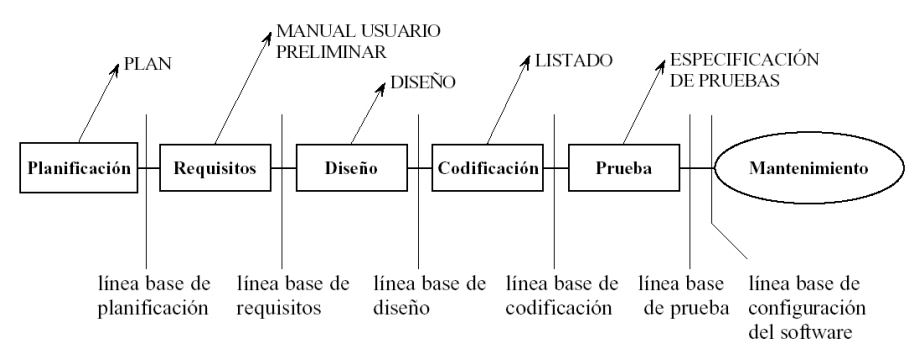
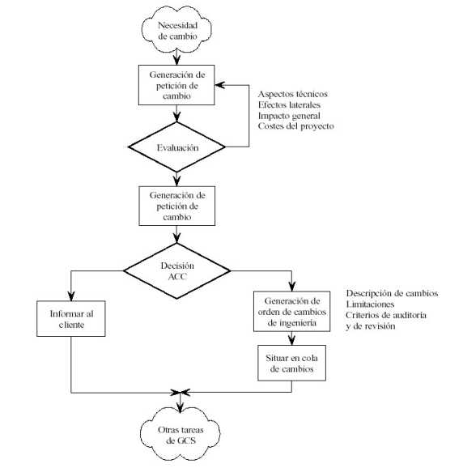

<h2 align="center"> Gestión de la Configuración del Software.</h2>

#### La GCS es el proceso de identificar y definir los elementos en el sistema, controlando el cambio de estos elementos a los largo de su ciclo de vida, registrando y reportando el estado de los elementos y las solicitudes de cambio, y verificando que los elementos estén completos y que sean correctos.
- _**Es una de autoprotección que se aplica durante el proceso de software**_.

### Que hace la GCS?
- Todos los involucrados en el proceso de software se relacionan en cierta medida con la gestión del cambio, pero en ocasiones se crean posiciónes de apoyo especializadas para adminstrar el proceso ACS.

### Elementos de la Gestión de la Configuración del Software (ECS).
Se pueden dividir en 3 categorías: Programas, Productos de Trabajo y Datos.

#### Algunos elementos de la configuración del software:
- Especificación del sistema.
- Plan del proyecto del software.
- Especificación del diseño.
	- Diseño preliminar.
	- Diseño detallado.
- Listados del código fuente.
- Planificación y procedimiento de prueba.
	- Casos de prueba y resultados registrados.
- Manuales de operación e instalación.
- Programas ejecutables.
- Descripción de la base de datos.
	- Esquemas, modelos
	- Datos iniciales.
- Manual de Usuario.
- Documentos de mantenimiento.
- Estándares y procedimientos de ingeniería del software.

### Organización de un repositorio de ECS

#### Contenido Empresarial:
- Reglas empresariales
- Funciones empresariales
- Estructura de organización
- Arquitectura de información

#### Contenido de Modelo:
- Casos de uso
- Modelo de análisis
	- Diagramas basados en escenarios
	- Diagramos orientados a flujo
	- Diagramas basados en clases
	- Diagramas de comportamiento
- Modelo de diseño
	- Diagramas arquitectónicos
	- Diagramas de interfaz
	- Diagramas en el nivel componente
- Métrica técnica

#### Contenido de construcción
...

#### Contenido V y V
...

#### Documentos
...

#### Contenido de gestión del proyecto
...

### Cuál es el origen del cambio?
#### Hay cuatro orígenes fundamentales
- Nuevas condiciones de negocio o mercado generan cambios en los requerimientos.
- Nuevas partes de las necesidades interesadas exigen modificaciones en funcionalidades, datos o servicios que ofrece el sistema.
- Reorganización, crecimiento o reducción de la empresa provoca cambios en las prioridades del proyecto	o estructura del equipo.
- Restricciones en el prosupuesto o calendario provocan redifiniciones en el sistema.

**El cambio puede ser producido en cualquier momento, las actividades de la GCS sirven para:**
- Identificar el cambio
- Controlar el cambio
- Garantizar que el cambio se implemente adecuadamente
- Informar del cambio a todos aquellos que puedan estar afectados

### Línea Base
Una **línea base** es un concepto de GCS que nos ayuda a controlar los cambios.

Definición de la IEEE: Una especificación o producto que se ha revisado formalmente y sobre el que se ha llegado a un acuerdo, y que de ahí en adelante sirve como base para un desarrollo posterior y que puede cambiarse solamente a través de procedimientos formales.

En el contexto de la ingeniería de software: _Una línea base es un punto de referencia en el desarrollo que queda marcado por el envío de uno o más ECS y su aprobación._

Una línea base es un entorno aislado en el que un desarrollador puede trabajar (editar, cambiar, compilar y probar) sin interferir con otros desarrolladores.

### Proceso de la GCS
El proceso define tareas con objetivos precisos:

1. _Identificación_: trata de establecer estándares de documentación y un esquema de identificación de documentos.

2. _Control de versiones_: Combinación de procedimientos y herramientas para gestinar las versiones de los ECS que se crean a lo largo del proceso del software.

3. _Control de cambios_: Consiste en la evaluación y registro de todos los cambios que se hagan en la configuración del software.

4. _Auditorias de la configuración_: Sirven, junto con las revisiones técnicas formales para garantizar que el cambio se ha implementado correctamente.

5. _Generación de informes_

### Identificación de los elementos en la GCS
Esta tarea tiene tres objetivos:
1. Definir una estructura de documentación organizada de un modo inteligible y predecible. Es decir, dar un formato.
2. Proporcionar métodos para revisiones y añadir los cambios conforme se producen (Identificar cada documento para la revisión y los cambios).
3. Relacionar los cambios con “quién, qué, cuándo, porqué, cómo” para facilitar el control.

- **Nombre:** _Cadena de caracteres sin ambigüedad_
- **Descripción:** _Lista de elementos de datos que identifican_

### Control de versiones
Ejemplo de software: Concurrent Version System (CVS).

- **Repositorio**: Se almacenan los archivos actualizados e históricos de cambio del proyecto.

- **Versión**: Determinar un conjunto de archivos.

- **Master**: Conjunto de archivos principales del proyecto.

- **Abrir rama-branch**: Bifurcación del máster para trabajar sobre dos ramas de forma independiente.

- **Desplegar check-out**: Copia del trabajo local desde el repositorio.

- **Publicar - Commit**: Una copia de los cambios hechos a una copia local es escrita o integrada sobre un repositorio.

- **Conflicto**: Problema entre las versiones de un mismo documento

- **Cambio - diff**: Representa una modficación específica.

- **Integración - Merge**: Fusión entre dos ramas del proyecto.

- **Actualización - sync o update**: Integra los cambios que han sido hechos en el repositorio y las copias locales.

### Control de cambios.
Es un mecanismo para la evaluación y aprobación de los cambios hechos a elementos de la configuración de software durante el ciclo de vida.

La autoridad de control de cambios (ACC) evalúa:
- Como impactará el cambio en el hardware?
- Como impactará el cambio en el rendimiento?
- Como alterará el cambio la percepción del cliente sobre el producto?
- Como afectará el cambio a la calidad y a la fiabilidad?
- ...

### Auditoría de la configuración
Se centran en las siguientes cuestiones:
1. ¿Se ha hecho el cambio especificado en la orden de cambio de ingeniería? ¿Se han incorporado modificaciones adicionales?
2. ¿Se ha realizado una revisión técnica formal para comprobar la corrección técnica?
3. ¿Se han seguido adecuadamente los estándares de ingeniería del software? 
4. ¿Se han marcado los cambios en el ECS? ¿Se han especificado la fecha y el autor del
cambio? ¿Refleja la identificación del ECS los cambios?
5. ¿Se han seguido los procedimientos del GCS para señalar el cambio, registrarlo y
divulgarlo?
6. ¿Se han actualizado adecuadamente todos los ECS relacionados? 

### Generación de informes
La generación de informes de estado de la configuración (auditoría) desempeña un papel vital en el éxito del proyecto.  
Responde a las preguntas: 
1. ¿Qué pasó?
2. ¿Quién lo hizo?
3. ¿Cuándo pasó?
4. ¿Qué más se vio afectado?

