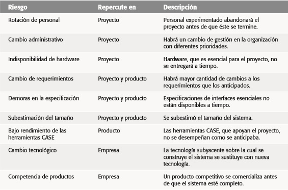
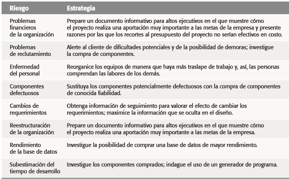

# Gestión de Riesgos
### _Un riesgo es un evento no deseado que tiene consecuencias negativas._

La gestión de riesgos en proyectos de software es un aspecto fundamental para garantizar el éxito de cualquier proyecto. Los riesgos pueden surgir en diferentes etapas del ciclo de vida del software y pueden tener un impacto negativo en el cumplimiento de lo objetivos del proyecto, como el retrado de la entrega, el aumento de los costos o la disminución de la calidad del producto final.

## Proceso de Gestión de Riesgos.
#### Es un proceso iterativo que debe documentarse y consta de cuatro puntos importantes: 
- _Identificación de Riesgos:_ listado de riesgos potenciales.
- _Análisis de Riesgos:_ listado de priorización de riesgos.
- _Planeación de Riesgos:_ anulación de riesgos y planes de contingencia.
- _Supervisión de Riesgos:_ valoración de riesgos.

### Identificación de Riesgos
Cada riesgo encontrado se tendría que categorizar en alguna de las siguientes:
- De proyecto
- De producto
- De negocio

Preguntas para la identificación de riesgos:
- Los gerentes de software y de cliente se reunieron formalmente para apoyar el proyecto?
- ¿Los usuarios finales se comprometen con el proyecto y sistema/producto que se va a construir?
- ¿El equipo y sus clientes entienden por completo los requisitos?
- ¿Los clientes se involucraron plenamente en la definición de los requisitos?
- ¿Los usuarios finales tienen expectativas realistas?
- ¿El ámbito del proyecto es estable?
- ¿El equipo tiene la mezcla correcta de habilidades?
- ¿Los requisitos del proyecto son estables?
- ¿El equipo tiene experiencia con la tecnología que se va a implementar?
- ¿El número de personas que hay en el equipo es adecuado para hacer el trabajo?
- ¿Todos los clientes/usuarios están de acuerdo en la importancia del proyecto y en los requisitos para el sistema/producto que se va a construir?

Se la respuesta es negativa a alguna de las preguntas anteriores estamos frente a un/unos riesgo/s inminentes/s. El grado de riesgo es directamente proporcional al nro. de repuestas negativas.

- Categorización de Riesgos

### Análisis de Riesgos
- Para cada riesgo se identifican su probabilidad e impacto.
- A partir de esto se construye la tabla de riesgos.

    - 1ra columna: Todos los riesgos en desorden.
    - 2da columna: Categoría del riesgo.
    - 3ra columna: Probabilidad estimada del riesgo (por consenso o individualmente o sacando un promedio).
    - 4ta columna: Impacto.

- Establecer una escala que refleje la probabilidad observada de un riesgo:
    - _Bastante improbable_: menor al 10%
    - _Improbable_: entre un 10% y 25%
    - _Moderado_: entre un 25% y un 50%
    - _Probable_: entre un 50% y un 75%
    - _Bastante probable_: mayor al 75%

- Estimar el impacto en el proyecto:
      
    1. _Catastrófico_: cancelación del proyecto.
    2. _Serio_: reducción de rendimiento, retrasos en la entrega, excesos importantes en costo.
    3. _Tolerable_: reducciones mínimas de rendimiento, posibles retrasos, excesos en costo.
    4. _Insignificante_: incidencia mínima en el desarrollo.

- Se ordena la lista por probabilidad e impacto y se traza una _línea de corte_
    - Identificar y supervisar los 10 riesgos más altos.
    - El número exácto de riesgos debe depender del proyecto.
    - Los riesgos que quedan por encima de la línea serán a los que se le preste atención
    - Los que quedes debajo de la línea serán reevaluados y tendrán una prioridad de segundo orden.

### Planeación de Riesgos
Se considera cada uno de los riesgos por encima de la línea de corte y se determina una estrategia a seguir.

- **Evitar el riesgo:** Siguiendo esta estrategia, el sistema se diseña de modo que no pueda ocurrir el evento.

- **Minimar el riesgo:** Siguiendo esta estrategia, la probabilidad que el riesgo presente se reduzca.

- **Plan de contingencia:** Siguiendo esta estrategia  se está preparado para lo peor. Se acepta la aparición del riesgo y es tratado de manera de minimizar las consecuencias.

La **exposición al riesgo, E** se determina usando la siguiente relación: `E = P * C`. Donde P es la probabilidad de ocurrencia para un riesgo y C es el costo para el proyecto si ocurre el riesgo.

### Supervisión de Riesgos
- Evaluar si ha cambiado la probabilidad de cada riesgo.
- Evaluar al efectividad de las estrategias propuestas.
- Detectar la ocurrencia de un riesgo que fue previsto.
- Asegurar que se están cumpliendo los pasos definidos para cada riesgo.
- Recopilar información para el futuro.
- Determinar si existen nuevos riesgos.
- Reevaluar periodicamente los riesgos.

Los riesgos deben monitorearse comunmente en todas las etapas de los del proyecto. En cada revisión administrativa, es necesario reflexionar y estudiar cada uno de los riesgos clave por separado.

También hay que decidir si es más o menos probable que surja el riesgo, y si cambiaron la gravedad y las consecuencias del riesgo.
